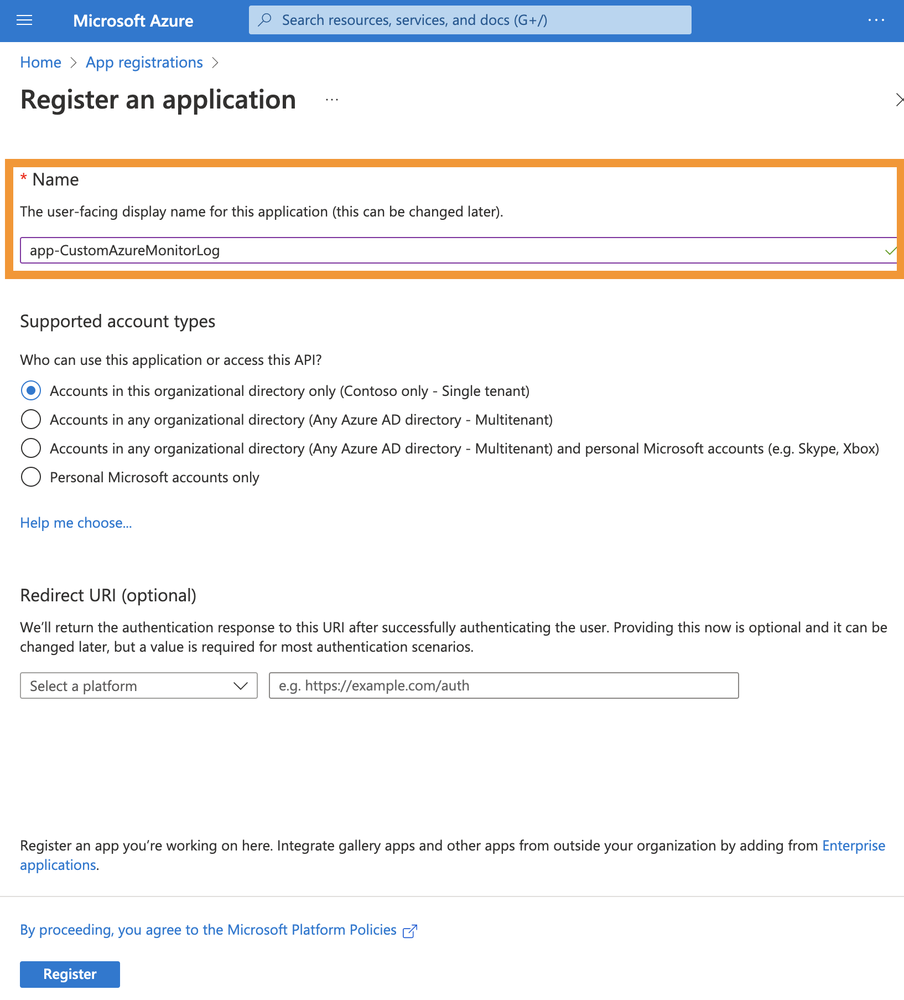

# Create Application Registration

BEFORE we can start with the deployment of the solution, we must create an app registration. Then the deployment can be done using the application (client) ID. After all Azure resources are deployed, permissions can be granted as described in the [Grant Permissions guid](./grantPermissionsToAppRegistration.md).

The app registration will be used to obtain multiple tokens in this tutorial:

1. Obtain a token to authenticate at 'API.loganalytics.io' to read the stored data in our log analytics workspace. This step is needed, because we must know when the latest entry in our custom log was created. This information lets us define a timeslot of data, which we will request with the second token.
2. Obtain a second token to authenticate at 'reports.office365.com' to gather message tracking log data from the Office 365 Reporting API. To learn more about the modern authentication process with the Office 365 Reporting API go to [THIS BLOGPOST](https://www.michev.info/Blog/Post/4067/modern-authentication-oauth-support-for-the-reporting-web-service-in-office-365) by Vasil Michev. He explains in detail how you can obtain a token for the Office365 Reporting API using modern authentication. Thanks for this great blogpost, Vasil!
3. Obtain a third token to authenticate at our data collection endpoint, e.g. at 'mycustomtableendpoint.datacenter-1.ingest.monitor.azure.com', to send data to our log analytics workspace.

You could create one app registration for each authentication process or a single app registration for all of them. For simplicity reasons, we will create a single app registration to obtain all of the above tokens in this tutorial.

## Create app registration

So, let's create the app registration for this solution. Go to [Azure Portal](https://portal.azure.com/#home), search for the service "App registration", switch to the service page and select "New registration".

Provide a name for your app registration and leave the rest at it's default setting.

After the app registration is created, you will be redirected to the app registration page. Here you can find the application (client) ID, which we will need later. Copy the application (client) ID and save it for later.
