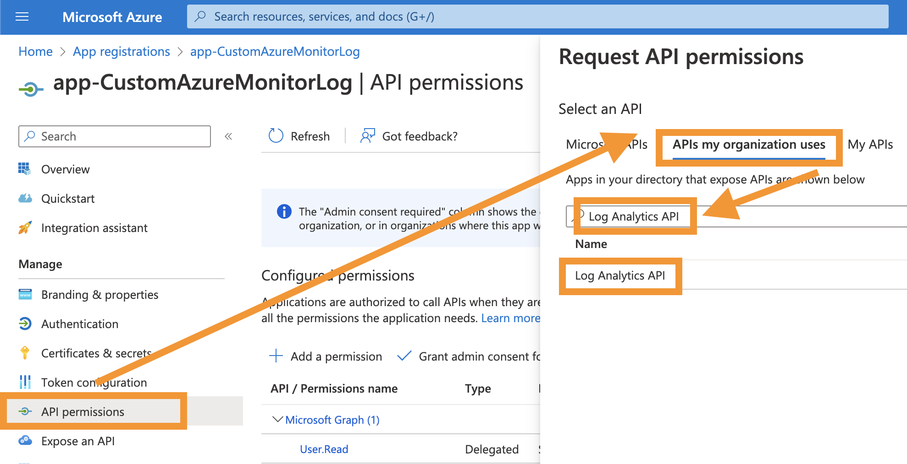
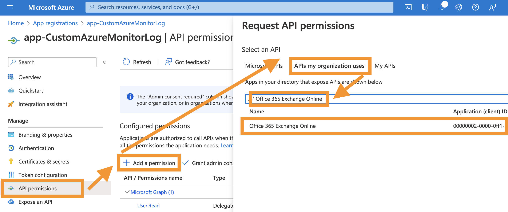
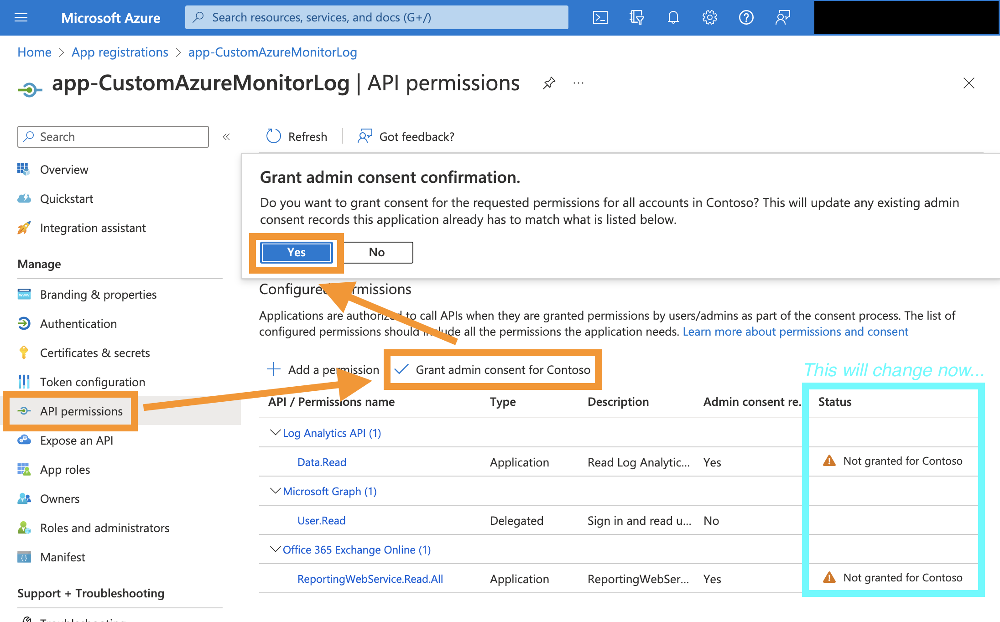
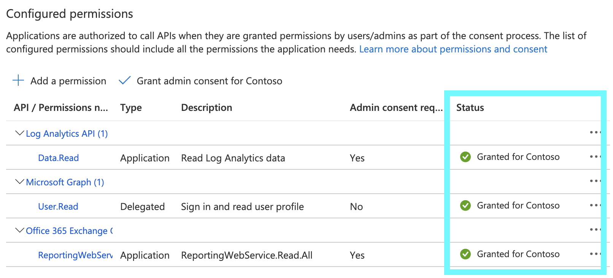
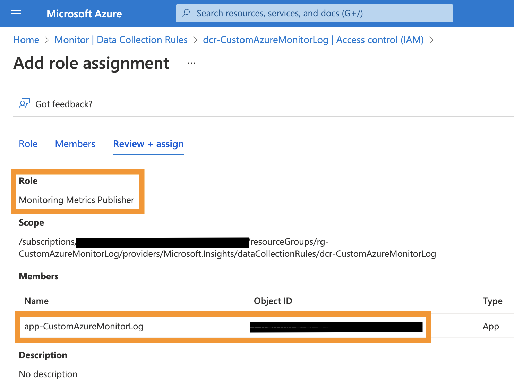

# Assign permissions to Application Registration

AFTER the deployment of all Azure resources is done, permissions can be granted as described in this section.

We must add permissions for each of the tokens, which we want to obtain data with it later.

The first permission is for the 'API.loganalytics.io' endpoint. To add the permission go to your newly created application registration &rarr; API permissions &rarr; Add a permission &rarr; APIs my organization uses &rarr; search for 'Log Analytics API' and click on the search result.

Now, select application permission &rarr; select the permission 'Data.Read' and add the permission.

For the second token, which in case of the message trace data is used at the Office365 Reporting API endpoint we will add the application permission, which allows us to read data from the reporting web service. To do so go to your newly created application registration &rarr; API permissions &rarr; Add a permission &rarr; APIs my organization uses &rarr; search for 'Office 365 Exchange Online' and click on the search result.

Now, select application permission &rarr; search for 'ReportingWebService' &rarr; select the permission 'ReportingWebService.Read.All' and add the permission.

Repeat these steps for further permissions if needed. For example, if you want to get the TeamsUserActivity and TeamsDeviceUsage data, you have to grant the "Reports.Read.All" permission from Microsoft Graph.

The final step, related to adding permissions to the app registration, is to grant admin consent for the two added API application permissions. Go to [Azure Portal](https://portal.azure.com/#home), search for the service "App registration", switch back to the service page &rarr; select 'API permissions' &rarr; 'Grant admin consent for Contoso' &rarr; confirm the pop-up.

Now, admin consent is granted and all needed permissions are in place.

Additionally, for the Exchange Online permission, we must add the app registration to the "Global Reader" role. Go to [Azure Portal](https://portal.azure.com/#home), search for the service "Azure Active Directory", switch to the service page. Then select 'Roles and Administrators' &rarr; select the 'Global Reader' role &rarr; select 'Add assignments' &rarr; select the link to add new members 'No member selected' &rarr; search your app registration &rarr; select 'Select' &rarr; select 'Next' &rarr; provide a justification &rarr; and assign the new role member.

After this, your app registration should be member of the role group you picked.

The third permission is for your custom data collection rule. To add the permission you must switch back to your data collection rule in the Azure Monitor page.
Go to [Azure Portal](https://portal.azure.com/#home), search for the service "Monitor" and switch to the service page. Select "Data collection rule" and click on your previously created data collection rule.

Now, select 'Access Control (IAM)' &rarr; Add role assignment &rarr; select 'Monitoring Metrics Publisher' &rarr; select Next. Then, select 'select members' &rarr; search for the name of your app registration &rarr; select the app registration &rarr; select 'Review + assign' to assign the permission.

## Add permission on Log Analytics workspace for app registration

Lastly, we have to add a permission on the Log Analytics workspace for our app registration, so we are able to read data from it. To add the permission go to [Azure Portal](https://portal.azure.com/#home), search for the service "Log Analytics workspace", switch to the service page and select "Access control (IAM)". Then hit '+ Add' and select 'Add role assignment'. On the new page select 'Monitoring Reader' as role, your app registration as user and select 'Review + assign'.

## Add client certificates or secrets to app registration

In the previous section we configured, which permissions our tokens will have later. Now, we must configure how we have to authenticate using our application registration to obtain a token in the first place. The best option is to upload a certificate, but a secret could also be possible. The PowerShell module 'CustomAzureMonitorLog' is also designed for both authentication options, but we will use a certificate for now.

In your app registration select 'Certificates & secrets' &rarr; Certificates &rarr; Upload certificate. Then upload the certificate (public key) and confirm by selecting 'Add'. Please use the same certificate, which you also used for the [manual deployment](../AzureResources/manualDeployment.md) or [automated deployment](../AzureResources/automatedDeployment.md).

You should see the new certificate listed now.

We will use this certificate later on with our unattended Azure Function App and interactive PowerShell module to obtain the tokens.
