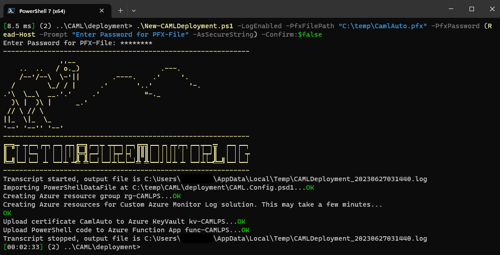

# Automatic Deployment of Azure components

Prepare and run the PowerShell script below to implement a Azure Log Analytics workspace, Azure App registration, Azure Function App and other necessary components, to use this PowerShell module fully automated. To run all steps of the deployment script manually, check out the [manual deployment guide](manualDeployment.md).
If you expierence any issues during the deployment, please check out the [known issues guide](../../knownIssues.md).
After you fixed a problem, you can continue the deployment by running the script again.

## Pre-requisites

To run the deployment script, you must have the following pre-requisites:

* This script must be used on a Windows machine with [PowerShell 7.3](https://learn.microsoft.com/en-us/powershell/scripting/install/installing-powershell-on-windows?view=powershell-7.3) or higher installed.
* Azure tenant / Azure Subscription to create and configure the needed resources
* Permissions to create and configure the needed resources in Azure
* [bicep](https://learn.microsoft.com/en-us/azure/azure-resource-manager/bicep/install#windows) is installed on your machine

Additionally, you must have the following PowerShell modules installed on your machine:

* [Azure.Function.Tools](https://www.powershellgallery.com/packages/Azure.Function.Tools/)
* [Az.Accounts](https://www.powershellgallery.com/packages/Az.Accounts/)
* [Az.KeyVault](https://www.powershellgallery.com/packages/Az.KeyVault/)
* [Az.Resources](https://www.powershellgallery.com/packages/Az.Resources/)
* [Az.WebSites](https://www.powershellgallery.com/packages/Az.Websites/)

To download and install all of them at once, use the run the following code snippet:

```powershell
Install-Module -Name 'Azure.Function.Tools','Az.Accounts', 'Az.Resources', 'Az.KeyVault', 'Az.Websites'
```

## Deployment

In this example, we will use the automatic deployment script to create and configure the necessary Azure resources. To do so, you have to:

1. Create the application registration in Azure AD according to the [create App registration guide](../AppRegistrationAndPermissions/createAppRegistration.md).

2. If you don't have a certificate yet, create a self-signed certificate on your client.
    Therefore, adjust the two output paths and the "Subject" in the following cmdlet and execute it to create and export the certificate. The .pfx file will be password protected. You will need the password later in the deployment process.

    ``` PowerShell
    $certName = 'myCert' # Name should include alphanumeric characters only
    $cerOutputPath = "C:\temp\$certName.cer"
    $pfxOutputPath = "C:\temp\$certName.pfx"
    $newSelfSignedCertProps = @{
        'Subject' = "CN=$certName"
        'CertStoreLocation' = 'Cert:\CurrentUser\My'
        'KeyExportPolicy' = 'Exportable'
        'KeySpec' = 'Signature'
        'KeyLength' = 2048
        'KeyAlgorithm' = 'RSA'
        'HashAlgorithm' = 'SHA256'
    }
    $cert = New-SelfSignedCertificate @newSelfSignedCertProps
    Export-Certificate -Cert $cert -FilePath $cerOutputPath # Exports public key of the certificate to a .cer file
    Export-PfxCertificate -Cert $cert -FilePath $pfxOutputPath -Password (Read-Host -Prompt "Enter Password for PFX-File" -AsSecureString) # Exports private key of the certificate to a .pfx file
    ```

    Source: [Create a self-signed public certificate to authenticate your application](https://learn.microsoft.com/en-us/azure/active-directory/develop/howto-create-self-signed-certificate)

    You should now have two files in your specified output folder: a password protected .pfx file and a .cer file.

3. Download this repository to your local machine and unzip it.

4. Customize the [CAML.Config.psd1](../../../deployment/CAML.Config.psd1) file in your local copy of this repository. The mandatory settings you have to edit are

    * TenantId       = '00000000-0000-0000-0000-000000000000' # Your Azure AD tenant id

    * SubscriptionId = '00000000-0000-0000-0000-000000000000' # Your Azure subscription id

    * AppId                 = '00000000-0000-0000-0000-000000000000' # Azure AD application registration identifier from step 1

    * CertificateName       = 'myCertName' # Name of your certificate as it will be named in Azure Key Vault

    * CertificateThumbprint = '0000000000000000000000000000000000000000' # Certificate Thumbprint

    PLEASE REMEMBER to also check the other settings of the [CAML.Config.psd1](../../../deployment/CAML.Config.psd1), if you want to customize the deployment to your needs.

5. Open a PowerShell 7.3 or later and navigate to the [deployment](../../../deployment) folder of your local copy of this repository.

6. Run the [New-CAMLDeployment.ps1](../../../deployment/New-CAMLDeployment.ps1) script using the following, recommended parameters and adjust the PfxFilePath accordingly to the path of your .pfx file:

    ```powershell
        .\New-CAMLDeployment.ps1 -LogEnabled -PfxFilePath "C:\myFolder\myCert.pfx" -PfxPassword (Read-Host -Prompt "Enter Password for PFX-File" -AsSecureString) -Confirm:$false
    ```

    The Deployment script will ask you for your credentials for the connection to Microsoft Azure if needed. Please enter your credentials and confirm the login process. The script will continue afterwards and create all necessary resources in your Azure subscription.

    

7. After the deployment is finished, grant permissions on the application registration according to the [grant permissions on application registration guide](../AppRegistrationAndPermissions/grantPermissionsToAppRegistration.md).

## CONGRATULATIONS

THAT'S IT! YOU'VE DONE IT! You have successfully deployed the CAML solution to your Azure subscription.

To learn how you can use the data in Log Analytics, check out the [Investigate data](../../investigateData.md) section.
