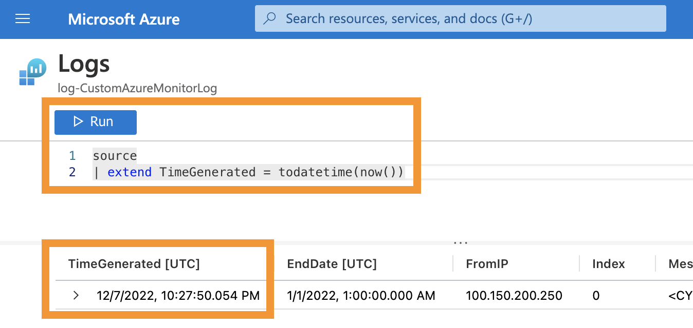

# Manual Deployment of Azure components

Follow the instructions below to implement a Azure Log Analytics workspace, Azure App registration, Azure Function App and other necessary components, to use this PowerShell module fully automated. To run all the steps described below automatically, check out the [automated deployment guide](automatedDeployment.md).

## Table of contents

[Section 1: Prepare Log Analytics workspace to store data](#section-1-prepare-log-analytics-workspace-to-store-data)

- Create a resource group and a log analytics workspace
- Create a data collection endpoint
- Add a custom log table

[Section 2: Create and configure App registration](#section-2-create-and-configure-app-registration)

- Create a app registration
- Assign app permissions
- Add client certificates or secrets to app registration
- Add permission on Log Analytics workspace for app registration

[Section 3: Create and configure Function App](#section-3-create-and-configure-function-app)

- Create Function App
- Upload actual code to Function App

[Section 4: Create and configure KeyVault](#section-4-create-and-configure-keyvault)

- Create a KeyVault
- Upload certificate to KeyVault

[Section 5: Add environment variables to Azure Function App](#section-5-add-environment-variables-to-azure-function-app)

- Configure Azure function

## Manual deployment

Without further ado, let's configure all components in Azure to kick this off!

### Section 1 Prepare Log Analytics workspace to store data

First of all, we must create a resource group which will combine all necessary resources. To do so, go to [Azure Portal](https://portal.azure.com/#home), search for "Resource groups", switch to the service page and select "Create".

Select your subscription, provide a name for your resource group, select your desired region and select "Review + create".


Now, we must prepare our Log Analytics workspace, which will store the received data in "custom tables". These tables enable you for example to use KQL queries to read the stored data afterwards. This section is based on the description in [Tutorial: Send data to Azure Monitor Logs using REST API (Azure portal)](https://learn.microsoft.com/en-us/azure/azure-monitor/logs/tutorial-logs-ingestion-portal).

#### Create Log Analytics workspace

Go to [Azure Portal](https://portal.azure.com/#home), search for the service "Log Analytics workspace", switch to the service page and select "Create".

Select your subscription, select an existing resource group or create a new one and provide a name for your Log Analytics workspace.


#### Create data collection endpoint

Next, we must create a data collection endpoint.

"_A data collection endpoint (DCE) is required to accept the data from the script. Once you configure the DCE and link it to a data collection rule, you can send data over HTTP from your application. The DCE must be located in the same region as the Log Analytics workspace where the data will be sent._" (Source: [Tutorial: Send data to Azure Monitor Logs using REST API (Azure portal) - Create data collection endpoint](https://learn.microsoft.com/en-us/azure/azure-monitor/logs/tutorial-logs-ingestion-portal#create-data-collection-endpoint)

Go to [Azure Portal](https://portal.azure.com/#home), search for the service "Monitor" and switch to the service page. Select "Data collection endpoints" &rarr; "Create".

"_Provide a name for the data collection endpoint and ensure that it's in the same region as your workspace. Click Create to create the data collection endpoint._" (Source: [Tutorial: Send data to Azure Monitor Logs using REST API (Azure portal) - Create data collection endpoint](https://learn.microsoft.com/en-us/azure/azure-monitor/logs/tutorial-logs-ingestion-portal#create-data-collection-endpoint)


#### Add custom log table

"_Before you can send data to the workspace, you need to create the custom table that the data will be sent to._" (Source: [Tutorial: Send data to Azure Monitor Logs using REST API (Azure portal) - Add custom log table](https://learn.microsoft.com/en-us/azure/azure-monitor/logs/tutorial-logs-ingestion-portal#add-custom-log-table))

Go to [Azure Portal](https://portal.azure.com/#home), search for the service "Log Analytics workspace" and switch to the service page. Select your newly created log analytics workspace &rarr; Tables &rarr; Create &rarr; New custom log (DCR based).


Provide a name for the custom log table, create a new data collection rule and select your previously created data collection endpoint.


On the next page, upload a sample as JSON of the future data which you will send to this log. A sample file for the message trace report from the Office 365 Reporting web service is already provided in this repository [here](./Sample_MessageTrace_Entry.json). If you want to import other data, you can create a sample file using the "Get-CAMLCustomLogTable" cmdlet of this module, export it as JSON and upload it. For more information about this cmdlet check out it's help block.


After uploading the sample, you will notice a message which asks you to use the transformation editor to populate 'TimeGenerated' column.
To add a column named 'TimeGenerated' with the current datettime to each row select "Transformation editor" and paste the following [Kusto Query Language (KQL)](https://learn.microsoft.com/en-us/azure/data-explorer/kusto/query/) query:

``` kql
source
| extend TimeGenerated = todatetime(now())
```

If you want to transform more information, e.g. adding additional columns or filtering source data, you can extend the query above according to your needs.

Select Run to view the results for the sample file:



Apply all changes and create your custom log table.


### Section 2 Create and configure App registration

Now, we must create a app registration. The app registration will be used to obtain multiple tokens in this tutorial:

1. Obtain a token to authenticate at 'API.loganalytics.io' to read the stored data in our log analytics workspace. This step is needed, because we must know when the latest entry in our custom log was created. This information lets us define a timeslot of data, which we will request with the second token.
2. Obtain a second token to authenticate at 'reports.office365.com' to gather message tracking log data from the Office 365 Reporting API. To learn more about the modern authentication process with the Office 365 Reporting API go to [THIS BLOGPOST](https://www.michev.info/Blog/Post/4067/modern-authentication-oauth-support-for-the-reporting-web-service-in-office-365) by Vasil Michev. He explains in detail how you can obtain a token for the Office365 Reporting API using modern authentication. Thanks for this great blogpost, Vasil!
3. Obtain a third token to authenticate at our data collection endpoint, e.g. at 'mycustomtableendpoint.datacenter-1.ingest.monitor.azure.com', to send the message tracking log data to our log analytics workspace

You could create one app registration for each authentication process or a single app registration for all of them. For simplicity reasons, we will create a single app registration to obtain all of the above tokens in this tutorial.

#### Create app registration

So, let's create the app registration and add all necessary permissions for this solution. Go to [Azure Portal](https://portal.azure.com/#home), search for the service "App registration", switch to the service page and select "New registration".

Provide a name for your app registration and leave the rest at it's default setting.


#### Assign permissions to app registration

Now we must add permissions for each of the tokens, which we want to obtain with it later.
The first permission is for the 'API.loganalytics.io' endpoint. To add the permission go to your newly created application registration &rarr; API permissions &rarr; Add a permission &rarr; APIs my organization uses &rarr; search for 'Log Analytics API' and click on the search result.


Now, select application permission &rarr; select the permission 'Data.Read' and add the permission.


For the second token, which is used at the Office365 Reporting API endpoint, we must add multiple permissions. First, we will add the application permission, which allows us to read data from the reporting web service. To do so go to your newly created application registration &rarr; API permissions &rarr; Add a permission &rarr; APIs my organization uses &rarr; search for 'Office 365 Exchange Online' and click on the search result.


Now, select application permission &rarr; search for 'ReportingWebService' &rarr; select the permission 'ReportingWebService.Read.All' and add the permission.


Repeat these steps for further permissions if needed. For example, if you want to get the TeamsUserActivity and TeamsDeviceUsage data, you have to grant the "Reports.Read.All" permission from Microsoft Graph.

The final step, related to adding permissions to the app registration, is to grant admin consent for the two added API application permissions. Go to [Azure Portal](https://portal.azure.com/#home), search for the service "App registration", switch back to the service page &rarr; select 'API permissions' &rarr; 'Grant admin consent for Contoso' &rarr; confirm the pop-up.


Now, admin consent is granted and all needed permissions are in place.


Additionally, for the Exchange Online permission, we must add the app registration to either the "Global Reader" role. Go to [Azure Portal](https://portal.azure.com/#home), search for the service "Azure Active Directory", switch to the service page. Then select 'Roles and Administrators' &rarr; select the 'Global Reader' role &rarr; select 'Add assignments' &rarr; select the link to add new members 'No member selected' &rarr; search your app registration &rarr; select 'Select' &rarr; select 'Next' &rarr; provide a justification &rarr; and assign the new role member.

After this, your app registration should be member of the role group you picked.


The third permission is for your custom data collection rule. To add the permission you must switch back to your data collection rule in the Azure Monitor page.
Go to [Azure Portal](https://portal.azure.com/#home), search for the service "Monitor" and switch to the service page. Select "Data collection rule" and click on your previously created data collection rule.


Now, select 'Access Control (IAM)' &rarr; Add role assignment &rarr; select 'Monitoring Metrics Publisher' &rarr; select Next. Then, select 'select members' &rarr; search for the name of your app registration &rarr; select the app registration &rarr; select 'Review + assign' to assign the permission.


#### Add permission on Log Analytics workspace for app registration

Lastly, we have to add a permission on the Log Analytics workspace for our app registration, so we are able to read data from it. To add the permission go to [Azure Portal](https://portal.azure.com/#home), search for the service "Log Analytics workspace", switch to the service page and select "Access control (IAM)". Then hit '+ Add' and select 'Add role assignment'. On the new page select 'Monitoring Reader' as role, your app registration as user and select 'Review + assign'.


#### Add client certificates or secrets to app registration

In the previous section we configured, which permissions our tokens will have later. Now, we must configure how we have to authenticate using our application registration to obtain a token in the first place. The best option is to upload a certificate, but a secret could also be possible. The PowerShell module 'CustomAzureMonitorLog' is also designed for both authentication options, but we will use a certificate for now. 

If you don't have a certificate yet you can create a self-signed certificate on your client.
Therefore, run the following cmdlet to create and export the certificate:

``` PowerShell
$cerOutputPath = 'C:\myFolder\myCert.cer'
$pfxOutputPath = 'C:\myFolder\myCert.pfx'
$newSelfSignedCertProps = @{
    'Subject' = 'CN=<certName>'
    'CertStoreLocation' = 'Cert:\CurrentUser\My'
    'KeyExportPolicy' = 'Exportable'
    'KeySpec' = 'Signature'
    'KeyLength' = 2048
    'KeyAlgorithm' = 'RSA'
    'HashAlgorithm' = 'SHA256'
}
$cert = New-SelfSignedCertificate @newSelfSignedCertProps
Export-Certificate -Cert $cert -FilePath $cerOutputPath # Exports public key of the certificate to a .cer file
Export-PfxCertificate -Cert $cert -FilePath $pfxOutputPath -Password (Read-Host -Prompt "Enter Password for PFX-File" -AsSecureString) # Exports private key of the certificate to a .pfx file
```

Source: [Create a self-signed public certificate to authenticate your application](https://learn.microsoft.com/en-us/azure/active-directory/develop/howto-create-self-signed-certificate)

In your app registration select 'Certificates & secrets' &rarr; Certificates &rarr; Upload certificate. Then upload the certificate (public key) and confirm by selecting 'Add'.

You should see the new certificate listed now.


We will use this certificate later on with our unattended Azure Function App and interactive PowerShell module to obtain the tokens.

### Section 3 Create and configure Function App

Now we have almost everything prepared, so let's get to business and configure our Azure Function App.

#### Create Function App

Go to [Azure Portal](https://portal.azure.com/#home), search for the service "Function App", switch to the service page and select "Create". Select your subscription and resource group &rarr; provide a name for your function app &rarr; select 'PowerShell Core' as runtime stack and '7.2' as version &rarr;.

Make sure, that 'Monitoring' is still enabled (it is enabled by default) because this will help you debugging later, if you want to customize this module.

In this tutorial we will not use a CI/CD pipeline (Continuous deployment) to keep it simple, although it is be highly recommended, to use source control and a CI/CD pipeline to sync changes to your function app. For now we will concentrate on the actual deployment of this tutorial.


Create the function app and switch to it's overview by selecting 'Go to resource'.
Now, select 'Identity', switch the 'Status' for the system assigned identity to 'On' and hit 'Save'. This will create a managed identity, which we can use to assign permissions for your Azure Function App.


#### Upload actual code to Function App

To add the script files to our Function App, you can use the "Set-CAMLAzureFunctionFiles.ps1" script, which is located inside the "scripts"-folder of this repository.
This script automatically creates a "Function.zip"-file, which contains the necessary files for the Azure Function App and uploads it to your function app. 
To use the script, you have to be logged into Azure using the "Connect-AzAccount -TenantId TenantId" cmdlet and run the script with the two mandatory parameters:

``` PowerShell
    <#
        .PARAMETER AppRg
        Provide a String containing the name of your Azure Resource Group.

        .PARAMETER AppName
        Provide a String containing the name of your Azure Function App.
    #>
```

Alternatively you can upload the contents of this repository where folder [function](../../../function/) will be the root of the app files.

Select 'Deployment Center' and select 'FTPS credentials'. Now use the shown FTPS endpoint uri and appliation username and password to connect via FTPS to this endpoint. Use your favorite FTP client and upload the contents of folder [function](../../../function/) including all it's subfolders and files to '/site/wwwroot'. Your folder structure should look like this now:


Please remember to overwrite the 'host.json', 'profile.ps1' and 'requirements.psd1' as well.

### Section 4 Create and configure KeyVault

We are almost there... We want to keep our certificates safe, so we will have to upload the certificate to Azure KeyVault and access it later with our Azure Function App and interative PowerShell session. So, let's create the Azure KeyVault. Go to [Azure Portal](https://portal.azure.com/#home), search for the service "Key vaults", switch to the service page and select "Create".

Select your subscription, select your existing resource group and provide a name for your Key Vault. Select the corresponding region and hit 'Next'.
On the 'Access policy' page, add a permission for your Azure Function App, so it's allowed to retrieve certificates and secrets from your Key Vault. Therefore, in the 'Access policies' section select 'Create' &rarr; select 'Get' for secret permissions and certificate permissions and hit 'Next' &rarr; search your system assigned managed identity, which we created earlier for your Azure Function App, by name or guid and select it &rarr; hit 'Create'.


Now, we can hit 'Review + create' to jump directly to the 'Review + create' tab of the Key Vault creation wizard. Here you can check your settings and hit 'Create', to finally create the Azure Key Vault.


Switch to your new Azure Key Vault to add your certificate (or application secret, if you preferred a secret over certificate). As mentioned above we will stick to the recommended option, which is using a certificate. Select 'Certificates' and 'Generate/Import'


Select as 'Method of Certificate Creation' the available option 'Import' &rarr; Provide a name for your certificate &rarr; Upload your the certificate (including the private key!) &rarr; Provide the password for your certificate &rarr; select 'Create' to upload the certificate.


Awesome, your certificate is enabled and ready for usage now.


### Section 5 Add environment variables to Azure Function App

Our last step! Now that we have created all necessary components, we must tell our script some informations like the Uri of our data collection endpoint or the name of our KeyVault. As those information will be different for each tenant, you simply add the variables to your function app, so we do not have to hardcode those parameters into our scripts.

To add a variable to your application go back to your function app and select 'Configuration'.


There you can see some default variables already. We must add our own application settings, which will be used as 'environment variables' in our script. Keep in mind, that the variables must be named as described in the table below. The table also tells you where to find the value. Select 'New application setting' to add the following variables:

| Name (must be exactly this name)   | Value (based on this tutorial, your values may vary)                  | Description   |
|------------------------------------|-----------------------------------------------------------------------|---------------|
| CAML_WorkspaceId                   | 00000000-0000-0000-0000-000000000000                                  | Id of your Log Analytics workspace created in section 1. Verify it by switching to 'Log analytics workspace' in Azure Portal. |
| CAML_MessageTraceLawTable          | CAMLMessageTrace_CL                                                   | Name of your custom log table in Log Analytics workspace created in section 1. Verify it by switching to 'Log analytics workspace' &rarr; 'Tables' in Azure Portal. The '_CL' suffix must be included here. |
| CAML_MessageTraceDetailLawTable    | CAMLMessageTraceDetail_CL                                             | Name of your custom log table in Log Analytics workspace created in section 1. Verify it by switching to 'Log analytics workspace' &rarr; 'Tables' in Azure Portal. The '_CL' suffix must be included here. |
| CAML_TeamsUserActivityLawTabl      | CAMLTeamsUserActivity_CL                                              | Name of your custom log table in Log Analytics workspace created in section 1. Verify it by switching to 'Log analytics workspace' &rarr; 'Tables' in Azure Portal. The '_CL' suffix must be included here. |
| CAML_TeamsDeviceUsageLawTable      | CAMLTeamsDeviceUsage_CL                                               | Name of your custom log table in Log Analytics workspace created in section 1. Verify it by switching to 'Log analytics workspace' &rarr; 'Tables' in Azure Portal. The '_CL' suffix must be included here. |
| CAML_DceLogsIngestionUri           | <https://mycustomtableendpoint.datacenter-1.ingest.monitor.azure.com> | Autogenerated Uri of your data collection endpoint created in section 1. Verify it by switching to 'Azure Monitor' &rarr; 'Data collection endpoint' &rarr; 'Overview' in Azure Portal. |
| CAML_DcrImmutableId                | dcr-00000000000000000000000000000000                                  | Id of your data collection rule created in section 1. Verify it by switching to 'Azure Monitor' &rarr; 'Data collection rule' &rarr; 'Overview' &rarr; 'JSON View' in Azure Portal.  |
| CAML_ClientId                      | 00000000-0000-0000-0000-000000000000                                  | Id of your app registration created in section 2. Verify it by switching to 'App registrations' in Azure Portal. |
| CAML_TenantId                      | 00000000-0000-0000-0000-000000000000                                  | Id of your tenant. Verify it by switching to any resource, e.g. 'App registrations', in Azure Portal. |
| CAML_VaultName                     | kv-CustomAzureMonitorLog                                              | Name of your Azure Key Vault created in section 4. Verify it by switching to 'Key vaults' in Azure Portal. |
| CAML_VaultCertificateName          | cert-CustomAzureMonitorLog                                            | Name of your certificate uploaded in section 4. Verify it by switching to 'Key vaults' &rarr; 'Certificates' in Azure Portal. |
| WEBSITE_LOAD_CERTIFICATES          | 0123456789ABCDEF0123456789ABCDEF01234567                              | This application setting must be available, so the Azure Function App is able to use a certificate from Azure KeyVault, although the value can be any 40-character Base16 string. More information about this workaround on [StackOverflow](https://stackoverflow.com/questions/46114264/x509certificate2-on-azure-app-services-azure-websites-since-mid-2017)|

Each variable must be added like shown here:


After adding all variables, select 'Save' to save your changes. Your 'application settings' section should look something like this:


## CONGRATULATIONS

THAT'S IT! YOU'VE DONE IT! THAT'S IT! YOU'VE DONE IT! You have successfully deployed the CAML solution to your Azure subscription.

Your Azure Function App may already have been triggered multiple times, as it is configured to run every 15 minutes automatically. The Function App will have failed until now, as the variables in the 'application settings' were missing. But from now on you should see, that the Function App executes successfully. If you want to edit the intervall, change the [function.json](../function/SendCAMLMessageTraceTimer/function.json) file of the Azure Function. Check out your Function App &rarr; Functions &rarr; YourFunction (in this tutorial 'SendCAMLMessageTraceTimer') &rarr; Monitor, to see if the execution was successful.


To learn how you can use the data in Log Analytics, check out the [Investigate data](../../investigateData.md) section.
