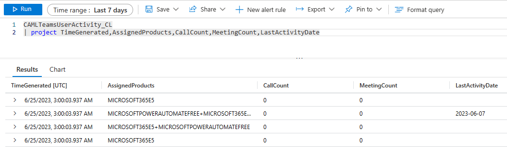

# Investigate Data

## Investigate Data manually in Log Analytics Workspace

After the first successful execution of one of the functions you start seeing data in your custom table. To check the contents of your custom log table go to [Azure Portal](https://portal.azure.com/#home), search for the service 'Log Analytics workspace' and switch to the service page. Select your Log analytics workspace &rarr; 'Logs'. Here, you can use [Kusto Query Language (KQL)](https://learn.microsoft.com/en-us/azure/data-explorer/kusto/query/) to work with your data. For example, you can view latest 100 entries of data, which has been send to the Log Analytics workspace by our Function App, using this query:

``` kql
CAMLMessageTrace_CL
| take 100
```

Your results should also look something like this:


or you can join the data of the two custom tables to see the details of the message trace:

``` kql
CAMLMessageTrace_CL
| join kind=inner CAMLMessageTraceDetail_CL on MessageTraceId
| project SenderAddress, RecipientAddress, Data
```

## Visualize data using Azure Workbooks

A greate visualization tool in Azure is "Azure Workbooks".
You can use it to create reports based on your data. To create a new workbook, go to [Azure Portal](https://portal.azure.com/#home), search for the service 'Log Analytics workspace' and switch to the service page. Select your Log analytics workspace &rarr; 'Workbooks' &rarr; '+ New Workbook'. Here, you can use [Kusto Query Language (KQL)](https://learn.microsoft.com/en-us/azure/data-explorer/kusto/query/) to work with your data. For example, you can view the count of messages sent and received by each day, using this query:

``` kql
CAMLMessageTrace_CL
| summarize count() by bin(Received, 1d)
| render areachart
```

Your results should look something like this:


Another example is to visualize the top 10 senders by SenderAddress:

``` kql
CAMLMessageTrace_CL
| summarize count() by SenderAddress
| top 10 by count_
| render barchart
```

Your results should look something like this:


For more information about Azure Workbooks, please visit the [Workbooks Overview](https://learn.microsoft.com/en-us/azure/azure-monitor/visualize/workbooks-overview) site.

## Present data in Azure Dashboards

Another great visualization tool in Azure is "Azure Dashboards".
You can use it to create dashboards based on your data. To create a new dashboard, go to [Azure Portal](https://portal.azure.com/#home), search for the service 'Log Analytics workspace' and switch to the service page. Select your Log analytics workspace &rarr; 'Dashboards' &rarr; '+ New Dashboard'. Here, you can integrate your Azure Workbooks as a tile or show the results of a query directly in a tile. Therefore, save a query in your Log Analytics Workspace, execute it and then click on 'Pin to' &rarr; 'Azure Dashboard'.


## Visualize data using PowerBI

You can also visualize your data using PowerBI.
The easiest way to create a new report based on your data fast is:

1. Create and run your desired query, to verify the needed data is returned.

    

2. From the Export menu select 'Export to PowerBI (new Dataset)'.

    

3. PowerBI will open in a new tab. There you have to provide a name for your new dataset and click 'Create'.

    

4. PowerBI will create a new dataset and open a new report.

    

    Here you can create your own visualizations based on the data of your custom table or let PowerBI visualize the data for you. To let PowerBI create the visualizations for you, click on '+ Create from scratch' and select 'Auto-create'.

    

5. DONE! PowerBI creates some beautiful visualizations for you, which you can use to create your own reports.

    

    Depending on what your data looks like, you can also create your own visualizations. For example, you can use the joined data of the two message trace related custom tables to
    - create a pie chart to see the distribution of the different message event types
    - visualize errors happening during the message transit
    - and much more!

    

    

Learn more about integrating PowerBI with Log Analytics [here](https://learn.microsoft.com/en-us/azure/azure-monitor/logs/log-powerbi).
