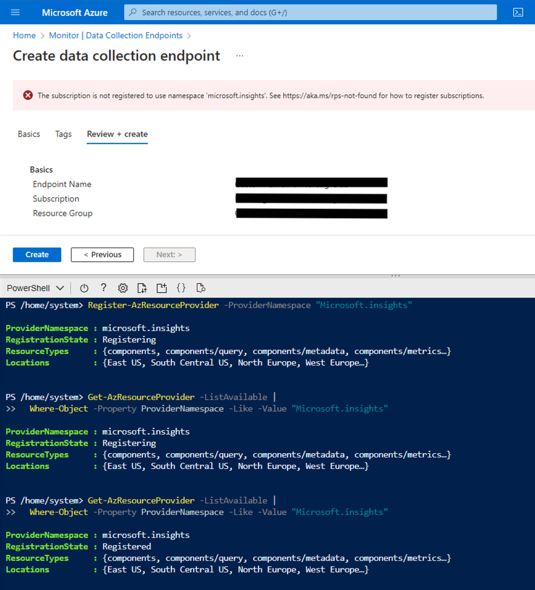
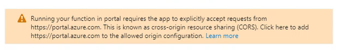
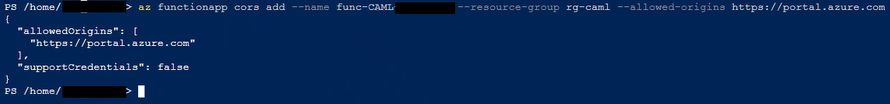

# CustomAzureMonitorLog - Known Issues

## Q: Error message "The subscription is not registered to use namespace 'microsoft.insights'. See <https://aka.ms/rps-not-found> for how to register subscriptions." when creating data collection endpoint

A: Visit <https://aka.ms/rps-not-found> to more information about the error message or use the following PowerShell cmdlet to register the namespace.

``` PowerShell
# Register the name
Register-AzResourceProvider -ProviderNamespace 'Microsoft.Insights'

# Get/View the current state of the registration
Get-AzResourceProvider -ListAvailable | Where-Object -Property ProviderNamespace -Like -Value 'Microsoft.Insights'
```

As soon as the RegistrationState changes to 'Registered' you can continue or restart the deployment.



<br>

## Q: Warning message when executing a function manually: "Running your function in portal requires the app to explicitly accept requests from "https://portal.azure.com".



A: This warning message is shown when you try to execute a function manually from the Azure Portal. To execute the function manually, you can enable cross-origin resource sharing for your function app using the following command in Azure CLI:

``` PowerShell
az functionapp cors add --name <FUNCTION_APP_NAME> --resource-group <RESOURCE_GROUP_NAME> --allowed-origins https://portal.azure.com
```

For more information, see [Enable cross-origin resource sharing](https://learn.microsoft.com/en-us/azure/azure-functions/functions-how-to-use-azure-function-app-settings?tabs=portal#cors).



<br>

## Q: We are in an environment with millions of mails per day and want to collect all message tracking logs. Is this possible?

A: Yes, CAML is designed to handle large amounts of data. But there are limitations in the Azure Function App consumption plan. For more information, see [Azure Functions hosting options](https://learn.microsoft.com/en-us/azure/azure-functions/functions-scale).
If your Function App crashed while running your functions, check if any limits are exceeded or try to use a different hosting plan e.g. 'Premium'.
Additionaly, be aware of the [Uncontrollable events](https://learn.microsoft.com/en-us/previous-versions/office/developer/o365-enterprise-developers/jj984332(v=office.15)#uncontrollable-events) in Exchange Online, which may limit the amount of data you can collect.
